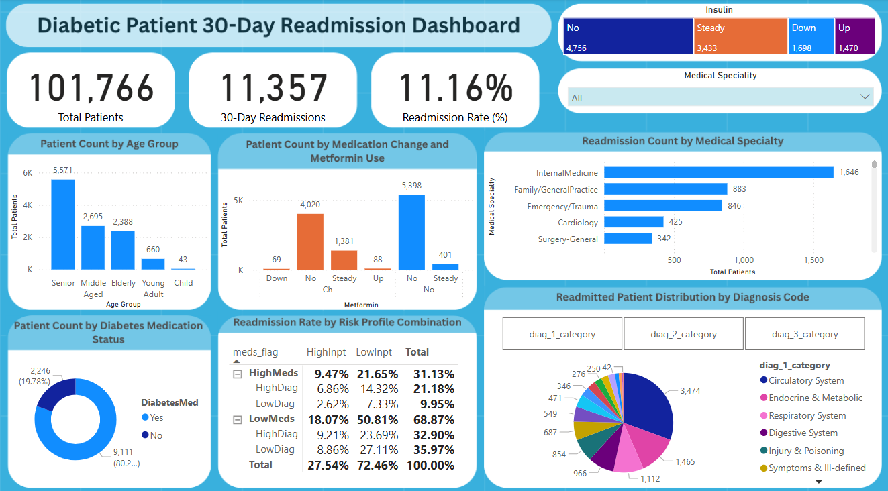

# 📊 Diabetic Patients 30-Day Readmission Analysis and Dashboard

This project explores the key factors contributing to **30-day hospital readmissions among diabetic patients** using the UCI Diabetes dataset. It integrates **Python** for EDA, **SQL Server** for query-driven profiling, and **Power BI** for interactive dashboard reporting.

---

## 🎯 Objective

To identify and visualize the most influential factors behind early hospital readmission (<30 days) in diabetic patients by analyzing clinical, treatment, and diagnostic variables.

---

## 📁 Repository Structure

```bash
├── images/
│   └── Diabetic_30_days_Readmission_Dashboard.png   # Dashboard screenshot
├── raw_data/
│   ├── IDS_mapping.csv
│   ├── Variables_Description.xlsx
│   └── diabetic_dataset.csv                         # Original dataset
├── Diabetes KPI Questions.pdf                        # KPI questions answered in the dashboard
├── Diabetes.ipynb                                   # Python EDA and statistics
├── Diabetic_Readmission_Dashboard.pbit              # Power BI Template file
├── SQLQuery1.sql                                     # SQL queries for analysis
├── README.md
```

---

## 📌 Key Project Steps

### 🔎 1. Exploratory Data Analysis (Python)
- Null value analysis, age group segmentation, and categorical mapping
- Chi-square and T-tests to detect significant variables
- ICD-9 code grouping into diagnostic categories

### 🗄️ 2. Data Querying (SQL Server)
- Aggregated readmission statistics
- Risk profile combinations: meds, inpatient history, diagnoses
- Grouped visual summaries for use in Power BI

### 📊 3. Dashboard Visualization (Power BI)
- 30-Day Readmission Rate & Patient Demographics
- Diagnosis-wise patient distribution (`diag_1`, `diag_2`, `diag_3`)
- Specialty-wise readmission trends
- Risk matrix visualization for top readmitted profiles

---

## 📷 Dashboard Preview



---

## 🔍 Findings Summary

- **Age**: Seniors (60–70) were most readmitted
- **Diagnosis**: Circulatory and Endocrine systems dominate across diag_1–3
- **Medication Behavior**: Insulin adjustments and metformin changes linked to higher risk
- **Specialties**: Internal Medicine saw the most readmitted cases
- **High-Risk Profiles**: Patients with frequent prior admissions (`HighInpt`) and low diagnoses (`LowDiag`) accounted for the largest portion of readmissions

---

## 📊 KPIs Answered

- What is the 30-day readmission rate?
- Which diagnosis categories appear most frequently across diag_1, diag_2, diag_3?
- What role do insulin, diabetes meds, and metformin play in readmission?
- Which patient risk profiles (meds + visits + diagnosis) dominate readmissions?

---

## 📎 Dataset Information

- **Source**: [UCI Machine Learning Repository](https://archive.ics.uci.edu/dataset/296/diabetes+130-us+hospitals+for+years+1999-2008)
- **Records**: 101,766 patient encounters from 130 hospitals
- **Years Covered**: 1999 to 2008

---

## 🧰 Technologies Used

- **Python** (Pandas, Seaborn, SciPy)
- **SQL Server (SSMS)**
- **Power BI**
- **DAX**

---

## 🧮 DAX Measures Used in Power BI

This project includes several custom DAX measures to support visualizations and KPI cards in Power BI. Below are key examples:

### 1. **30-Day Readmission Count**
```dax
Readmitted Patients =
CALCULATE(
    COUNTROWS(diabetic_readmission_records),
    diabetic_readmission_records[readmitted_flag] = 1
)
```

### 2. **Total Patients**
```dax
Total Patients = COUNTROWS(diabetic_readmission_records)
```

### 3. **Readmission Rate (%)**
```dax
Readmission Rate (%) =
DIVIDE(
    [Readmitted Patients],
    [Total Patients],
    0
)
```

### 4. **Risk Profile Share of Readmitted Patients**
```dax
Readmitted Patient Share (%) :=
VAR GroupReadmitted =
    CALCULATE(COUNTROWS(diabetic_readmission_records), diabetic_readmission_records[readmitted_flag] = 1)
VAR TotalReadmitted =
    CALCULATE(
        COUNTROWS(diabetic_readmission_records),
        diabetic_readmission_records[readmitted_flag] = 1,
        REMOVEFILTERS(
            diabetic_readmission_records[meds_flag],
            diabetic_readmission_records[inpt_flag],
            diabetic_readmission_records[diag_flag]
        )
    )
RETURN
DIVIDE(GroupReadmitted, TotalReadmitted, 0)
```

### 5. **Calculated Columns (for flag creation)**
```dax
meds_flag = IF(diabetic_readmission_records[num_medications] >= 20, "HighMeds", "LowMeds")
inpt_flag = IF(diabetic_readmission_records[number_inpatient] >= 2, "HighInpt", "LowInpt")
diag_flag = IF(diabetic_readmission_records[number_diagnoses] >= 9, "HighDiag", "LowDiag")
```

### 6. **Diagnosis Grouping Column**
```dax
diag_category = 
VAR diag_val = diabetic_readmission_records[diag_1]
VAR diag_num = IFERROR(VALUE(diag_val), BLANK())
RETURN
    SWITCH(
        TRUE(),
        ISBLANK(diag_val), "Unknown",
        LEFT(diag_val, 1) = "V", "Health Services Factors",
        LEFT(diag_val, 1) = "E", "External Causes of Injury",
        diag_val = "Uncoded", "Uncoded",
        NOT ISBLANK(diag_num) && diag_num >= 1 && diag_num <= 139, "Infectious & Parasitic Diseases",
        diag_num >= 140 && diag_num <= 239, "Neoplasms",
        diag_num >= 240 && diag_num <= 279, "Endocrine & Metabolic",
        diag_num >= 280 && diag_num <= 289, "Blood Diseases",
        diag_num >= 290 && diag_num <= 319, "Mental Disorders",
        diag_num >= 320 && diag_num <= 389, "Nervous System",
        diag_num >= 390 && diag_num <= 459, "Circulatory System",
        diag_num >= 460 && diag_num <= 519, "Respiratory System",
        diag_num >= 520 && diag_num <= 579, "Digestive System",
        diag_num >= 580 && diag_num <= 629, "Genitourinary System",
        diag_num >= 630 && diag_num <= 679, "Pregnancy & Childbirth",
        diag_num >= 680 && diag_num <= 709, "Skin & Subcutaneous",
        diag_num >= 710 && diag_num <= 739, "Musculoskeletal System",
        diag_num >= 740 && diag_num <= 759, "Congenital Anomalies",
        diag_num >= 760 && diag_num <= 779, "Perinatal Conditions",
        diag_num >= 780 && diag_num <= 799, "Symptoms & Ill-defined",
        diag_num >= 800 && diag_num <= 999, "Injury & Poisoning",
        "Other/Unknown"
    )
```

---

## 📥 How to Use This Project

1. Clone the repo  
2. Use `Diabetes.ipynb` to explore and preprocess the data  
3. Run `SQLQuery1.sql` to create views and tables in SQL Server  
4. Open `Diabetic_Readmission_Dashboard.pbit` in Power BI  
5. Connect to your SQL data source and explore the visuals

---

## 📜 License

This project is open-source and available under the MIT License.

---

## 🙌 Acknowledgements

- UCI ML Repository for the dataset  
- ICD9Data.com for diagnosis grouping references

---